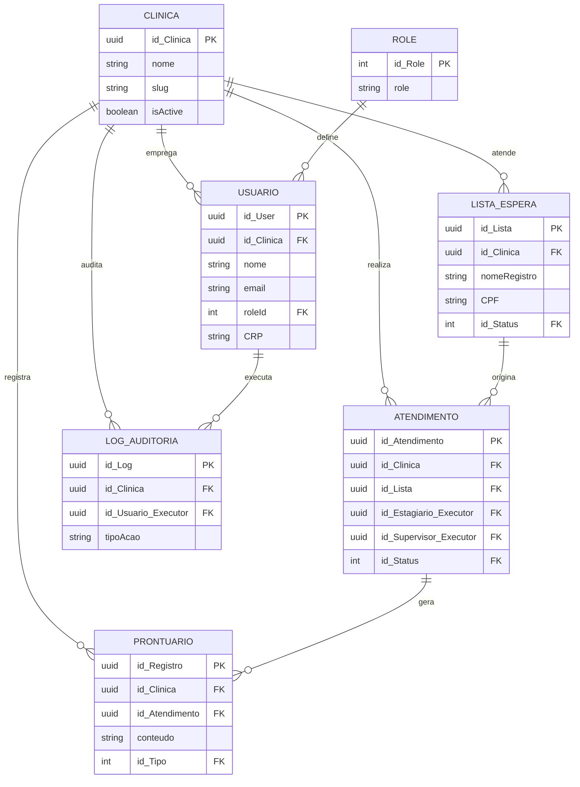

# Arquitetura do ARCA

Este documento é o mapa único do projeto: o que é, como está construído, o que já existe e o que falta. Se você está chegando agora — como colaborador ou voltando depois de um tempo parado — comece por aqui, não pelo Swagger. O Swagger mostra os endpoints; este documento mostra por que eles existem e como se encaixam.

Documentação relacionada:

- `README.md` — como instalar e rodar o projeto localmente
- `CLAUDE.md` — referência técnica rápida para sessões de desenvolvimento assistido (comandos, estrutura de pastas)
- `docs/adr/` — o histórico de decisões de arquitetura, uma por arquivo, nunca reescritas (só substituídas por uma ADR nova quando a decisão muda)

## 1. O que é o ARCA

Uma plataforma SaaS multi-tenant de gestão para clínicas de psicologia — cadastro de pacientes, fluxo clínico completo (triagem → psicoterapia → alta), documentação com validade regulatória (CFP 06/2019), auditoria e conformidade com LGPD. Múltiplas clínicas usam a mesma plataforma, com dados isolados entre elas.

Nasceu como TCC, mas é tratado como produto comercial real desde então — decisões técnicas seguem padrão de produção, não escopo acadêmico.

## 2. Stack e por que essas escolhas

| Camada | Tecnologia | Por quê |
| --- | --- | --- |
| Backend | NestJS + Prisma + PostgreSQL | Tipagem forte ponta a ponta, migrations versionadas, estrutura modular que escala bem pra um time pequeno |
| Frontend | Next.js 15 (App Router) + Server Actions | Sem camada de API intermediária no frontend — Server Actions falam direto com o backend, menos código de integração pra manter |
| Monorepo | Turborepo | Backend e frontend num repo só, cache de build compartilhado |
| Auth | Passport.js + JWT (backend) / NextAuth v4 (frontend) | JWT com audience/issuer validados; sessão do frontend guarda o token e injeta em toda chamada |
| Deploy | Coolify + Supabase | CD automático a cada push, banco gerenciado — sem precisar operar infraestrutura própria como dev solo |

## 3. Como as peças se encaixam

```text
Usuário → Next.js (Server Actions) → NestJS API → Prisma → PostgreSQL (Supabase)
                ↓
           NextAuth (sessão, JWT)
```

Decisões travadas para o frontend (detalhe completo no `CLAUDE.md`):

- Toda leitura/escrita de dado passa por Server Action, nunca por hook client-side batendo direto na API
- Route Handlers existem só para o NextAuth
- Nenhuma env var `NEXT_PUBLIC_` além do que o NextAuth exige
- App autenticado vive em `/plataforma/*`, dentro do route group `(auth)`; rotas públicas ficam em `(external)`

## 4. Modelo de domínio

O diagrama abaixo é o núcleo relacional do sistema. Os campos `id_Clinica` marcados representam o estado **planejado** (ver ADR 0001) — ainda não implementados no banco atual.



Fora do diagrama por clareza: tabelas de apoio globais (`Genero`, `Etnia`, `Escolaridade`, `StatusListaEspera`, `StatusAtendimento`, `TipoAtendimento`, `StatusProntuario`, `TipoProntuario`) — são lookups compartilhados entre todas as clínicas, não têm `id_Clinica`.

### Roles de banco de dados

O Postgres é acessado por dois roles distintos, com privilégios diferentes:

- **`arca_app`** — role de aplicação, least-privilege. É quem `DATABASE_URL` autentica; o backend NestJS e o `prisma db seed` rodam com esse role. Tem só `USAGE` no schema `public` e `SELECT`/`INSERT`/`UPDATE`/`DELETE` nas tabelas — sem permissão de alterar estrutura (criar/dropar tabela, coluna, etc.).
- **Role dono do schema** (superuser, ex. `postgres`) — é quem `DIRECT_URL` autentica. Só é usado pelo Prisma Migrate (`migrate dev`/`migrate deploy`/`migrate reset`), inclusive pra criar o shadow database exigido pelo `migrate dev`. Nunca é usado em runtime da aplicação.

Os privilégios de `arca_app` são concedidos via migração normal (`prisma/migrations/20260816214907_grant_arca_app_privileges/`), executada com o role dono do schema — não é um passo manual à parte. Isso significa que um banco novo, rodando só `prisma migrate deploy`, já sai com `arca_app` funcional.

O que a migração **não** faz — de propósito — é criar o role `arca_app` em si (`CREATE ROLE ... PASSWORD ...`). Roles são objetos do cluster Postgres, não do schema de uma aplicação específica, e a senha não pode ir pro Git. Por isso, provisionar `arca_app` (criar o role com login e senha própria por ambiente) é um passo de infraestrutura que precisa acontecer *antes* da primeira migração rodar em qualquer ambiente novo — se não acontecer, a migração de grants falha alto e claro ("role arca_app does not exist") em vez de deixar a aplicação falhar silenciosamente depois, em tempo de query.

Essa separação de roles é a base sobre a qual o enforcement de tenant via Row-Level Security (ADR 0001) vai se apoiar — é o que já existe hoje, mesmo antes do RLS em si estar implementado.

### Fluxo clínico (o que o sistema modela)

1. **Em Espera** — paciente se autocadastra publicamente, recebe UUID pra consultar posição
2. **Em Triagem** — secretário agenda sessão de triagem; estagiário preenche o relatório; supervisor aprova
3. **Aguardando Psicoterapia** — aprovado, esperando vaga
4. **Em Psicoterapia** — sessões recorrentes, evolução registrada e aprovada a cada sessão
5. **Alta / Encaminhado** — documento final gerado, paciente sai do sistema

### Papéis

| Papel | Acesso |
| --- | --- |
| Coordenador (ADMIN) | Tudo, incluindo auditoria e gestão de usuários |
| Secretário | Agendamento, lista de espera, visão de fluxo completo |
| Supervisor | Aprova relatórios de estagiários, gera documentos finais, vê só seus pacientes |
| Estagiário | Preenche relatórios, vê só seus pacientes |

## 5. Status atual

| Área | Status | Observação |
| --- | --- | --- |
| Backend — módulos core | ✅ Pronto | auth, users, waitlist, session, medical_record, audit, crypto, pdf |
| Backend — segurança base | ✅ Pronto | RBAC, rate limiting, helmet, JWT audience/issuer, auditoria global |
| Backend — multi-tenancy (schema) | 🔜 Planejado | ADR 0001 — issue aberta, ainda não implementado |
| Backend — enforcement de tenant + RLS | 🔜 Planejado | Depende do item acima |
| Backend — entidades de domínio ricas | 🔜 Planejado | Direção decidida (`Atendimento`, `Prontuario` com `fromPrisma()`), ainda não no código |
| Frontend — shell da plataforma | ✅ Pronto | Sidebar, proteção de rota, dashboard vazio em `/plataforma` |
| Frontend — módulos de domínio | ⏳ Não iniciado | Pacientes, atendimentos, waitlist etc. — tracked via milestones M0–M12 no GitHub |
| Documentação viva (ADRs) | 🟡 Começando | ADR 0001 é a primeira; adicionar ao repo em `docs/adr/` |

## 6. Decisões arquiteturais (ADRs)

Um ADR (Architecture Decision Record) registra **uma** decisão: o contexto que levou a ela, a decisão em si, e as consequências — inclusive as negativas. Nunca é editado depois de aceito; se a decisão muda, escreve-se um novo ADR que supera o anterior.

Ficam em `docs/adr/`, um arquivo por decisão, numerados em ordem (`0001-`, `0002-`...). Existentes:

- `0001-multi-tenancy-estrategia-hibrida.md` — banco único compartilhado com `clinicaId`, ao invés de um banco por clínica

Quando surgir uma dúvida do tipo "por que decidimos X" no futuro, a resposta deve estar aqui, não na memória de ninguém.

## 7. Pra quem está chegando agora

1. Leia este documento inteiro antes de tocar em código
2. Rode o projeto localmente seguindo o `README.md`
3. Veja as issues abertas no GitHub com o milestone atual — é o backlog priorizado
4. Convenções a seguir: identificadores de código em inglês, texto voltado ao usuário em português; Server Actions para toda integração com o backend no frontend; nenhuma lógica de negócio direto num controller — isso vai migrar para classes de domínio conforme a Seção 5 indica
5. Dúvida de arquitetura que este documento não responde? Provavelmente falta um ADR — é sinal de escrever um, não de perguntar de novo daqui a três meses
