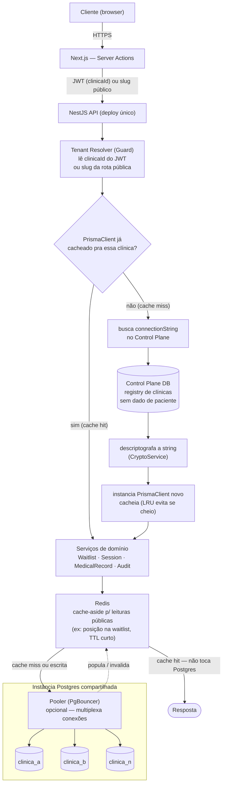

# ADR 0006: Multi-Tenancy — Isolamento Físico por Banco de Dados, Substituindo Schema Único com RLS

**Status:** Aceito
**Data:** 2026-08-20
**Supera:** ADR 0001 (estratégia de isolamento no schema), ADR 0004 (implementação RLS/schema único) e ADR 0005 (merge desse modelo para `development`)

## Contexto

A ADR 0001 decidiu isolamento multi-tenant via schema único: modelo `Clinica`,
coluna `id_Clinica` nas tabelas escopadas, Row-Level Security e uma Prisma
Client Extension injetando o filtro automaticamente. As ADRs 0004 e 0005
documentam essa implementação completa, validada com testes de integração
contra Postgres real, e já mergeada em `development`.

Em conversa entre os sócios sobre o modelo de vendas do ARCA como produto,
ficou claro que esse modelo não é compatível com banco único compartilhado
entre clínicas — o caminho mais seguro e alinhado ao produto é cada clínica
ter seu próprio banco de dados isolado fisicamente, não uma linha isolada por
política de RLS num schema compartilhado.

Isso levanta um problema operacional: hoje, trocar a string de conexão do
banco exigiria subir um backend novo por clínica, o que não escala. A
discussão que resultou nesta ADR cobriu como resolver isso de forma dinâmica:

- Um **control plane / registry de tenants** — banco Postgres pequeno e
  separado de todo dado de paciente — mapeando clínica → connection string,
  resolvido em tempo de request, para que um único deploy de backend (e
  frontend) sirva todas as clínicas.
- A topologia física escolhida para os bancos de clínica: **mesma instância
  Postgres, um banco (`CREATE DATABASE`) por clínica, com um role dedicado
  por banco** — não uma instância gerenciada inteira por clínica. Isso evita
  pagar o custo fixo de N instâncias gerenciadas enquanto a maioria das
  clínicas ainda é pequena, sem abrir mão de isolamento real: bancos
  diferentes na mesma instância não são alcançáveis por query cruzada sem
  `dblink`/`postgres_fdw`, que nunca são instalados/concedidos, e cada role
  só tem grant no seu próprio banco.
- Importante deixar registrado: essa topologia isola **vazamento de dado e
  BOLA cross-tenant** (o motivo original que levou a abandonar RLS), mas
  **não isola disponibilidade** — se a instância compartilhada cair, todas as
  clínicas nela caem juntas, assim como acontecia com schema único. O
  registry de tenants foi desenhado para tornar essa limitação temporária:
  como ele só guarda uma connection string por clínica, mover uma clínica
  específica para uma instância dedicada no futuro é uma mudança de dado no
  control plane, não uma mudança de arquitetura ou de código.

## Decisão

1. Cada clínica tem seu próprio banco de dados físico. Isolamento deixa de
   ser por `id_Clinica` + RLS e passa a ser por banco separado.
2. Cada banco de clínica tem um role Postgres dedicado, com grants restritos
   àquele banco — nenhum role de aplicação alcança mais de um banco de
   clínica.
3. Topologia padrão: todos os bancos de clínica vivem na mesma
   instância/cluster Postgres gerenciado (a escolha de provider da ADR 0003
   continua valendo). Qualquer clínica pode ser movida para uma instância
   dedicada depois, trocando só a connection string no control plane.
4. Um **registry de tenants** — banco Postgres dedicado, sem dado de
   paciente — guarda por clínica: `slug`, `connectionString` (criptografada
   em repouso, reaproveitando o padrão do `CryptoService` com uma
   `ENCRYPTION_KEY` distinta da usada em prontuário), `status`
   (`provisionando` / `ativa` / `suspensa`) e a versão de schema aplicada.
5. O `PrismaService` deixa de ser um singleton com uma `DATABASE_URL` fixa.
   Passa a existir um registry de clients cacheado por tenant no backend:
   resolve o tenant por request (slug/subdomínio, ou claim `clinicaId` do
   JWT após login), busca/cacheia um `PrismaClient` apontando para o banco
   daquela clínica, com LRU e expiração por inatividade para não esgotar
   `max_connections` da instância compartilhada.
6. Migrations passam a ser um fan-out: um runner que aplica a mesma migration
   em cada banco de clínica registrado, de forma idempotente — capaz de
   reexecutar apenas nos bancos que falharam, sem repetir os que já
   aplicaram com sucesso.
7. Provisionamento de clínica nova é um fluxo scriptável: criar banco, criar
   role, aplicar grants, rodar migrations, popular tabelas de apoio, e só
   então registrar no control plane com `status = ativa`.
8. O trabalho de RLS/CLS/Prisma Client Extension (ADR 0001/0004/0005, branch
   `107-adicionar-modelo-clinica-e-clinicaid-no-schema-adr-001`) deixa de ser
   a direção ativa da arquitetura. Fica preservado como referência técnica
   válida (a policy de RLS, o padrão da função `SECURITY DEFINER`, os bugs
   reais encontrados e como foram corrigidos), caso algum cenário futuro
   volte a justificar schema compartilhado — mas não é mais o caminho que o
   produto segue.
9. Um cache Redis (cache-aside) fica entre os serviços de domínio e o
   Postgres, para leituras públicas de alto volume repetido — o caso
   concreto é a consulta de posição na waitlist (`ListaEspera`), rota sem
   autenticação onde o mesmo paciente reconsulta o próprio status
   repetidamente. TTL curto, invalidado ativamente quando a fila muda (novo
   cadastro, atendimento agendado, remoção). Isso reduz volume e duração de
   query por conexão — complementar ao LRU de `PrismaClient` do item 5, não
   um substituto: reduz pressão sobre cada pool, mas não reduz quantos pools
   existem.

### Diagrama: da requisição ao banco da clínica

## Consequências

**Positivas:**

- Elimina estruturalmente o risco de vazamento cross-tenant: não depende de
  toda query ter o filtro certo, nem de RLS configurado sem furos — o que
  ADR 0004/0005 mostrou ser real (dois bugs de isolamento encontrados antes
  de produção, mesmo com o mecanismo bem implementado).
- Modelo de produto/vendas decidido com o sócio fica viável — cada clínica
  como unidade de dado isolada, não uma linha entre outras num schema
  compartilhado.
- O registry de tenants desacopla a topologia física: começar com bancos
  compartilhando instância e migrar clínicas específicas para instância
  dedicada depois é mudança de dado, não redesenho de arquitetura.
- Provisionamento de clínica nova já nasce como script automatizável — não
  repete a pendência que ADR 0004/0005 deixaram em aberto (seed manual, sem
  caminho para criar uma segunda clínica).

**Negativas / trade-offs:**

- Migrations passam a exigir um runner de fan-out com tratamento de falha
  parcial — peça de infraestrutura nova que não existia com schema único.
- A topologia padrão (bancos compartilhando instância) não isola
  disponibilidade: um outage da instância afeta todas as clínicas nela,
  igual acontecia com schema único. Isolamento de falha por clínica só
  existe quando/se uma clínica específica for movida para instância
  dedicada.
- O registry de tenants vira dependência crítica de todo login/request
  (mesmo guardando só metadado, não prontuário) — precisa de estratégia
  própria de cache/disponibilidade para não se tornar um novo ponto único de
  falha do tamanho do problema que a mudança busca evitar.
- `max_connections` da instância compartilhada precisa ser dimensionado
  considerando N bancos com pool próprio cada; sem o LRU de clients
  cacheados no backend, é fácil esgotar conexões.
- O trabalho de implementação de RLS/CLS deixa de ser o caminho ativo — não
  é perda (fica documentado como referência), mas é esforço de engenharia
  real que não vai virar produção como planejado em ADR 0004/0005.

## Em aberto (fora do escopo desta ADR, identificado na discussão)

- Estratégia de backup/restore por clínica quando vários bancos compartilham
  a mesma instância gerenciada — depende de o provider (ADR 0003) suportar
  restore granular por banco, ou exigir `pg_dump` agendado por tenant como
  estratégia suplementar.
- Dimensionamento de `max_connections`/pooler (PgBouncer ou nativo do
  provider) para suportar N bancos com pool cacheado no backend.
- Desenho concreto do cache Redis do item 9: quais chaves além de posição na
  waitlist valem cache-aside, TTL por caso de uso, e o mecanismo de
  invalidação ativa (evento de domínio disparando o invalidate, não só TTL
  passivo) para não servir posição desatualizada.
- Desenho concreto do runner de migration fan-out e do fluxo de
  provisionamento automatizado (criar banco + role + grants + seed +
  registro no control plane).
- Critério explícito para quando isolar disponibilidade por clínica
  (instância dedicada) vira tier comercial, e qual clínica cruza esse
  limiar.

## Alternativas consideradas

- **Manter schema único com RLS (ADR 0001/0004/0005)**: rejeitado — decisão
  de negócio (modelo de vendas/produto) tomada com o sócio, incompatível com
  múltiplas clínicas dividindo o mesmo schema, independente de o mecanismo
  técnico estar corretamente implementado.
- **Instância Postgres gerenciada dedicada por clínica desde já**: rejeitado
  por custo — providers gerenciados cobram por instância, e a maioria das
  clínicas não justifica esse custo fixo ainda. Fica disponível como opção
  via mudança no control plane, não como padrão inicial.
- **Schema-per-tenant (um schema Postgres por clínica, mesmo banco)**: não
  escolhido — isolamento intermediário entre RLS e banco físico separado,
  ainda dependente de `search_path`/grants configurados corretamente por
  schema, sem a garantia estrutural de banco fisicamente separado — e sem
  vantagem de custo sobre banco separado na mesma instância.
